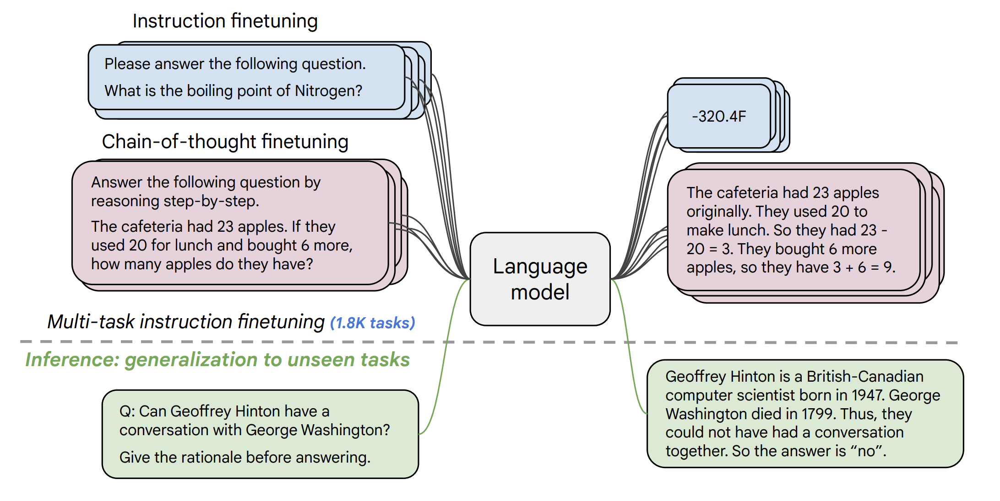
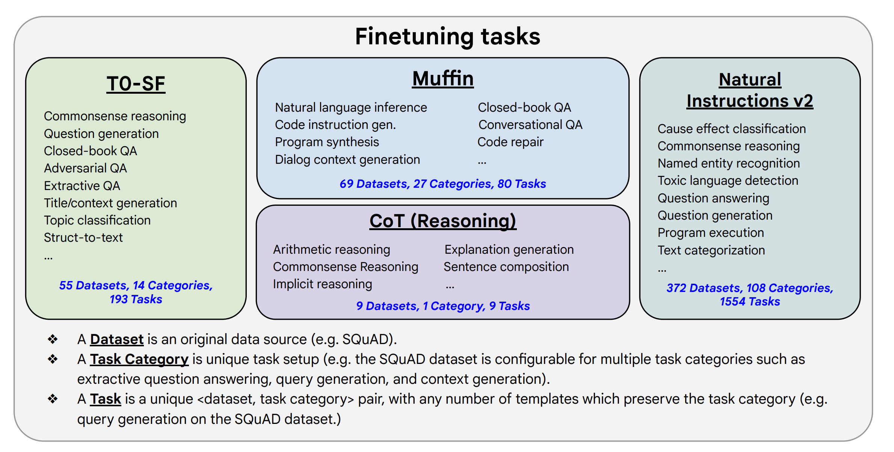

# 002--NLP大模型实践--Flan 20B with UL2

**参考资料**

- YouTube--[Trying Out Flan 20B with UL2 - Working in Colab with 8Bit Inference](https://www.youtube.com/watch?v=cMT3RzjawEc)

  Flan-UL2 20 Billion是谷歌公开发布的最新的Flan模型。在这个视频中，我展示了你如何通过HuggingFace库和使用8位推理在高端谷歌Colab上运行它。

**关键点--Keypoints：**

- 使用Mixture-of-Denoisers(MoD)语料进行训练；
- 2048个令牌的接收域(跨度)；
- 非限制性许可；
- 主要在学术任务方面接受训练；

**重要参考--Key References：**

- [Scaling Instruction-Finetuned Language Models](https://arxiv.org/abs/2210.11416) aka Flan2 

  - 在以指令为措辞的数据集上对语言模型进行微调已被证明可以提高模型的性能和对未见任务的概括性。在本文中，我们探讨了指令的微调，特别关注（1）任务数量的扩展，（2）模型规模的扩展，以及（3）思维链数据的微调。我们发现，上述方面的指令微调极大地提高了各种模型类别（PaLM、T5、U-PaLM）、提示设置（零-射击、少量射击、CoT）和评估基准（MMLU、BBH、TyDiQA、MGSM、开放式生成）的性能。例如，Flan-PaLM 540B在1.8K任务上的指令调整比PALM 540B要好很多（平均+9.4%）。Flan-PaLM 540B在一些基准测试上达到了最先进的性能，例如在五次拍摄的MMLU上达到了75.2%。我们还公开发布了Flan-T5检查点，即使与PaLM 62B等大得多的模型相比，也取得了强大的几发性能。总的来说，指令微调是一种提高预训练语言模型性能和可用性的通用方法。

- [UL2: Unifying Language Learning Paradigms](https://arxiv.org/abs/2205.05131) 

  - 现有的预训练模型一般都是针对某一类问题的。到目前为止，对于什么是正确的架构和预训练设置，似乎还没有达成共识。本文提出了一个统一的预训练模型框架，该框架在不同的数据集和设置中都是有效的。我们首先将架构原型与预训练目标分开，这两个概念通常被混为一谈。接下来，我们为NLP中的自我监督提出了一个普遍而统一的观点，并展示了不同的预训练目标是如何相互影响的，以及不同目标之间的插值如何有效。然后，我们提出了Mixture-of-Denoisers（MoD），一个将不同的预训练范式结合起来的预训练目标。我们进一步介绍了模式切换的概念，其中下游的微调与特定的预训练方案相关。我们进行了广泛的消融实验来比较多种预训练目标，并发现我们的方法在多种不同的设置中超越了T5和GPT类模型，从而推动了Pareto-frontier的发展。通过将我们的模型扩展到20B的参数，我们在50个成熟的基于监督的微调的NLP任务上实现了SOTA的性能。我们的模型在上下文学习方面也取得了很好的效果，在零次拍摄的SuperGLUE上超过了175B的GPT-3，在一次拍摄的总结上则是T5-XXL的三倍。在0-shot MMLU上，UL2 20B的表现超过了T0和T5模型。UL2 20B在思维链提示和推理方面也很好，使其成为研究20B参数的中小规模推理的一个有吸引力的选择。最后，我们将FLAN指令调整应用于UL2 20B模型，实现了与FLAN-PaLM 62B相竞争的MMLU和Big-Bench得分。我们为UL2 20B和Flan-UL2 20B发布了基于Flax的T5X检查点。

- [Yi Tay's Blog about the release](https://www.yitay.net/blog/flan-ul2-20b)

  - Flan 20B with UL2 20B checkpoint

    UL2 20B早在2022年第二季度就已经开源了（见 "Blogpost: UL2 20B: An Open Source Unified Language Learner"）。UL2 20B（准确地说是~19.5B的参数）完全在C4语料库上训练（类似于T5模型）。UL2模型是在新的UL2目标上训练的，该目标在denoisers的混合物上训练（多样化的跨度腐败和前缀语言建模任务）。

    我们对带有Flan的UL2 20B模型做了两个主要更新:

    1. 最初的UL2模型只在接受域为512的情况下进行训练，这使得它在N大的情况下不适合于N-shot提示。这个Flan-UL2检查点使用的是2048的接受域，这使得它更适用于少量的内涵学习。
    2. 最初的UL2模型也有模式开关令牌，这是为了获得良好的性能而必须的。然而，它们有点麻烦，因为这需要在推理或微调时经常进行一些改变。在这次更新/改变中，我们继续对UL2 20B进行额外的10万步训练（小批量），以便在应用Flan指令调整之前忘记 "模式标记"。这个Flan-UL2检查点不再需要模式令牌了。

  - Chain-of-thought capabilities get much better

    这组实验的一个值得注意的结果是，CoT版本的MMLU和BBH任务的收益有更大的delta，例如，与Flan-T5 XXL相比，MMLU为+7.4%，BBH为+3.1%。这可能是由于模型的总体规模较大，也可能是由于UL2本身具有CoT能力（见论文的CoT部分）。它可能是两者的结合。

    还值得注意的是，MMLU和BBH的CoT版本似乎仍然比直接提示更糟糕。然而，这些差异也适用于较大的Flan-PaLM 62B模型（甚至有时也适用于Flan-PaLM 540B），在这些模型中也观察到同样的现象。在这一点上，我们还探索了自洽性（Wang等人）来提高CoT性能，仅通过使用自洽性，就在CoT上经历了+6%的相对改善。在这个特殊的独立实验中，CoT+自我一致性的设置比直接提示的性能要好3%。

    我们没有时间去探索CoT+Self一致性的这个扩展的搜索空间，所以我们把这个问题留给未来的工作，或者是留给读者的一个练习:)。

  - Limitations of Flan

    Flan系列模型是一个很好的紧凑的模型家族，在发射、服务和做许多伟大的事情方面相对成本低廉。它也是免费的，而且是不受限制的许可!然而，Flan式模型也有一些限制。例如，Flan主要是在学术任务上进行教学调整，其产出通常是简短、"学术 "和传统的（见@ShayneRedford的推特）。你可以把Flan想象成是对 "学术任务的学术任务 "的教学调整。关于学术任务是否仍有意义的辩论完全是另一个问题。

    尽管如此，Flan2论文中的第6节 "人的可用性 "显示，Flan在包括创意、解释等在内的开放式生成方面仍然提高了可用性。

    总的来说，事实证明，如果你知道自己的用途，Flan系列模型是有影响的，也是有用的。我们希望人们在考虑Flan模型能做什么和不能做什么时，尤其要牢记上述限制。

  - **Expanding the options (and size ceiling) of Flan family of models!**

    总的来说，Flan-UL2 20B模型将目前Flan-T5模型的尺寸上限扩大了约2倍，也就是说，如果人们愿意，现在可以选择到20B。根据我们的评估，我们认为Flan-UL2是一个比Flan-T5 XXL更好的模型。

    它也是目前Big-Bench hard和MMLU上最好的开源模型。

