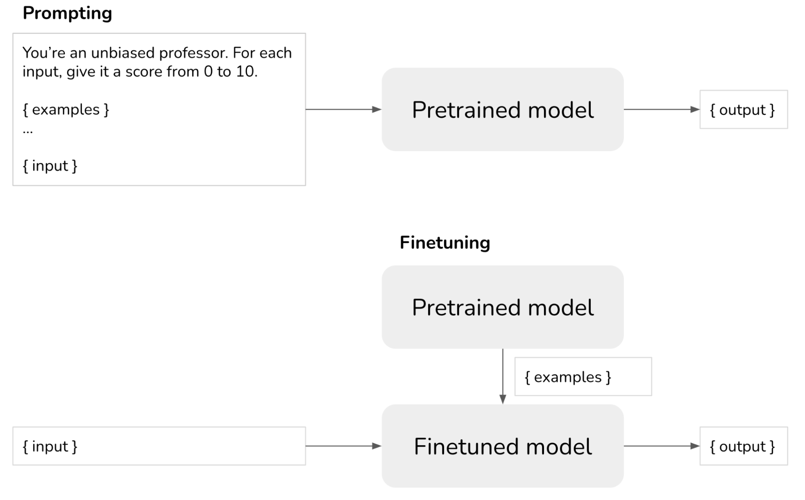
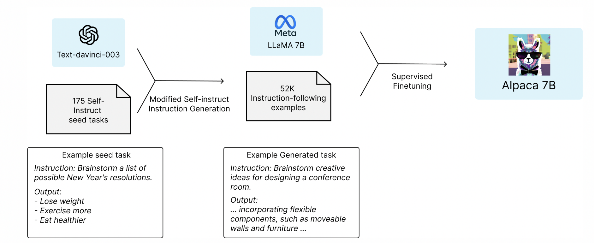
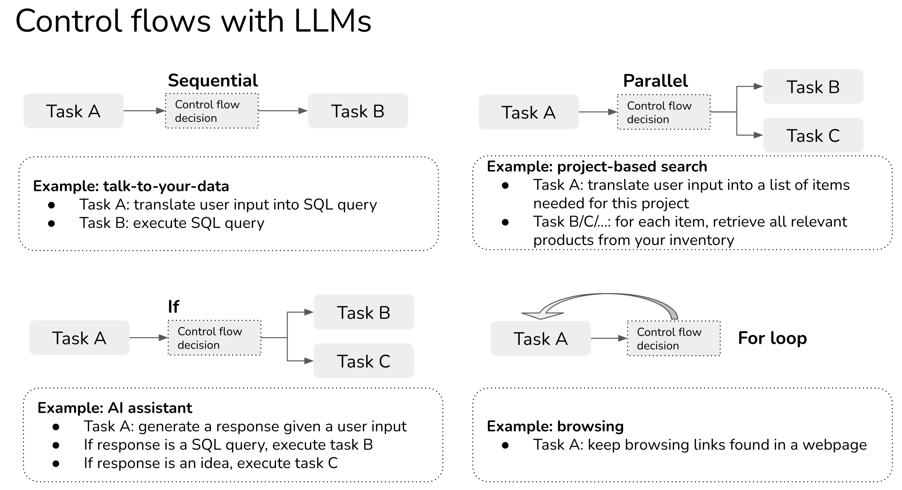

# Twitter资料收集

**更新时间：**

- 2023-04-13


### **目录：**

1. Ranking LLMs for distraction；
2. Bringing LLM applications to production；
3. Hello Dolly：通过开放模型让 ChatGPT 的魔力大众化；
4. Alpace--羊驼： 一个强大的、可复制的指令遵循模式；
5. Prompt engineering--提示语工程；
6. DeepSpeed--大模型的加速训练及推理工具；
7. DeepSpeed Chat；


## 1、Ranking LLMs for distraction

**信息源：**

- [Link](https://twitter.com/JagersbergKnut/status/1646164877285703681)

**性能排行：**

1. GPT-4
2. GPT-distilling-alpaca-30b
3. ChatGPT / GPT-3.5
4. Alpaca-30b
5. galpaca-30b
6. Llama 30b
7. GPT-4-alpaca-13b
8. Vicuna-13b
9. Koala-13b
10. Alpaca-13b
11. Flan-t5-xxl
12. GPT-3
13. GAL-30b
14. ChatGLM 6b
15. Llama 13b
16. GPT-4all-7b
17. Chat-gpt-neox
18. chat-pythia 12b
19. GPT-neox
20. Llama-7b
21. Flan-t5-base
22. GPT-j
23. GPT-2 xl / megatron


## 2、Bringing LLM applications to production

**信息源：**

- [Link](https://twitter.com/chipro/status/1646189847625998336)

最近我经常被问到的一个问题是大型语言模型 (LLM) 将如何改变机器学习工作流程。在与几家使用 LLM 应用程序的公司合作并亲自深入构建我的应用程序之后，我意识到两件事：

1. 使用 LLM 很容易做出很酷的东西，但是很难用它们做出可用于生产的东西。
2. LLM 的局限性因即时工程中缺乏工程严谨性而加剧，部分原因是自然语言的模棱两可性，部分原因是该领域的新生性质。

**这篇文章由三部分组成：**

- 第 1 部分讨论生产 LLM 应用程序的主要挑战和我所见过的解决方案。
- 第 2 部分讨论如何使用控制流（例如 if 语句、for 循环）组合多个任务，以及如何为更复杂和更强大的应用程序整合工具（例如 SQL 执行器、bash、web 浏览器、第三方 API）。
- 第 3 部分涵盖了一些我见过的公司在 LLM 之上构建的有前途的用例，以及如何从较小的任务构建它们。


### <span style='color:brown'>**第 I 部分--生产提示工程的挑战**</span>

#### 及时评估

prompt engineering 的一个常用技术是在 prompt 中提供一些示例，并希望 LLM 能够从这些示例中概括（fewshot learners）。

在做fewshot learning时，要记住两个问题：

1. **LLM是否理解提示中给出的例子**。评估这一点的一种方法是输入相同的示例并查看模型是否输出预期分数。如果模型在提示中给出的相同示例上表现不佳，可能是因为提示不明确——您可能想要重写提示或将任务分解为更小的任务（并将它们组合在一起，在详见本文第二部分）。
2. **LLM 是否过拟合这些 fewshot 示例。**您可以在单独的示例上评估您的模型。

#### 及时版本控制

对提示的小改动可能会导致截然不同的结果。对每个提示的性能进行版本控制和跟踪至关重要。您可以使用 git 对每个提示及其性能进行版本控制，但如果有像 Mflow 或 Weights & Biases 这样的工具用于提示实验，我不会感到惊讶。

#### 及时优化

已经有很多论文+博文写了如何优化提示。我同意 Lilian Weng 在[她有用的博客文章中的观点](https://lilianweng.github.io/posts/2023-03-15-prompt-engineering/)，即大多数关于提示工程的论文都是可以用几句话解释的技巧。OpenAI 有一个很棒的笔记本，[用例子解释了很多技巧](https://github.com/openai/openai-cookbook/blob/main/techniques_to_improve_reliability.md#how-to-improve-reliability-on-complex-tasks)。这里是其中的一些：

- 提示模型解释或逐步解释它是如何得出答案的，这种技术被称为[思维链](https://arxiv.org/abs/2201.11903)或 COT（Wei 等人，2022 年）。**权衡**：由于输出令牌数量的增加，COT 会增加延迟和成本[参见**成本和延迟**部分]
- 为相同的输入生成多个输出。通过多数票（也称为Wang 等人，2023 年的[自洽技术）选择最终输出，或者您可以让您的法学硕士选择最好的一个。](https://arxiv.org/abs/2203.11171)在 OpenAI API 中，您可以通过传入参数[n](https://platform.openai.com/docs/api-reference/completions/create)为同一输入生成多个响应（如果您问我，这不是理想的 API 设计）。
- 将一个大提示分解为更小、更简单的提示。

#### 提示与微调与替代方案

- 提示：对于每个样本，明确告诉您的模型它应该如何响应。
- Finetuning：训练模型如何响应，因此您不必在提示中指定。



在考虑提示与微调时有 3 个主要因素：数据可用性、性能和成本。

如果您只有几个示例，则提示可以快速轻松地开始。**由于最大输入令牌长度，您可以在提示中包含的示例数量是有限制的。**

当然，为任务微调模型所需的示例数量取决于任务和模型。然而，根据我的经验，如果您对 100 个示例进行微调，您可以预期模型性能会发生显着变化。然而，结果可能并不比提示好多少。

[提示值有多少个数据点](https://arxiv.org/abs/2103.08493)？(2021)，Scao 和 Rush 发现一个提示值大约 100 个示例（警告：任务和模型之间的差异很大——见下图）。总的趋势是，**随着示例数量的增加，微调将提供比提示更好的模型性能**。可以使用多少个示例来微调模型没有限制。

微调的好处有两个：

1. 你可以获得更好的模型性能：可以使用更多的例子，例子成为模型内部知识的一部分。
2. 您可以降低预测成本。您可以融入模式的指令越多，您需要放入提示中的指令就越少。**比如说，如果您可以在每次预测的提示中减少 1k 个标记，那么对于gpt-3.5-turbo**上的 1M 预测，您将节省 2000 美元。

#### 蒸馏微调

2023 年 3 月，一群斯坦福学生发布了一个很有前途的想法：在由较大语言模型 (text-davinci- *003* – 1750 亿个参数）。这种训练小模型模仿大模型行为的技术称为蒸馏。生成的微调模型的行为类似于*text-davinci-003*，同时更小且运行成本更低。

为了进行微调，他们使用了 52k 条指令，将其输入到*text-davinci-003*中以获得输出，然后将其用于微调 LLaMa-7B。生成成本不到 500 美元。微调的培训过程成本不到 100 美元。参见[Stanford Alpaca：An Instruction-following LLaMA Model](https://github.com/tatsu-lab/stanford_alpaca) (Taori et al., 2023)。




### 嵌入+矢量数据库

我发现非常有前途的一个方向是使用 LLM 生成嵌入，然后在这些嵌入之上构建您的 ML 应用程序，例如搜索和 recsys。**截至 2023 年 4 月，使用较小模型text-embedding-ada-002 的**嵌入成本为 0.0004 美元/1k 代币。如果每个项目平均 250 个标记（187 个单词），则此定价意味着每 10k 个项目 1 美元或 100 万个项目 100 美元。

虽然这仍然比一些现有的开源模型成本更高，但它仍然非常实惠，因为：

1. 您通常只需为每个项目生成一次嵌入。
2. 使用 OpenAI API，可以轻松地实时嵌入查询和新项目。

要了解有关使用 GPT 嵌入的更多信息，请查看[SGPT （Niklas Muennighoff，2022 年）或](https://github.com/Muennighoff/sgpt)[有关 GPT-3 嵌入性能和成本的](https://medium.com/@nils_reimers/openai-gpt-3-text-embeddings-really-a-new-state-of-the-art-in-dense-text-embeddings-6571fe3ec9d9)分析（Nils Reimers，2022 年）。Nils 帖子中的一些数字已经过时（该领域发展如此之快！！），但方法很棒！

为实时用例嵌入模型的主要成本是将这些嵌入加载到矢量数据库中以实现低延迟检索。但是，无论您使用哪种嵌入，您都将承担这笔费用。看到如此多的矢量数据库蓬勃发展是令人兴奋的——新的数据库如 Pinecone、Qdrant、Weaviate、Chroma 以及现有的 Faiss、Redis、Milvus、ScaNN。

**如果说 2021 年是图数据库元年，那么 2023 年就是矢量数据库元年**。


### <span style='color:brown'>**第 2 部分--任务可组合性**</span>

#### 包含多个任务的应用程序

上面的示例争议评分器由一个任务组成：给定输入，输出争议分数。然而，大多数应用程序都比较复杂。考虑“与您的数据对话”用例，我们想要连接到数据库并以自然语言查询该数据库。想象一张信用卡交易表。你想问这样的事情：`"How many unique merchants are there in Phoenix and what are their names?"`你的数据库将返回：`"There are 9 unique merchants in Phoenix and they are …"`。

一种方法是编写一个程序来执行以下任务序列：

1. 任务 1：将用户的自然语言输入转换为 SQL 查询 [LLM]
2. 任务二：在SQL数据库中执行SQL查询【SQL执行器】
3. 任务三：将SQL结果转化为自然语言响应展示给用户[LLM]



#### 使用 LLM 代理控制流程

在传统的软件工程中，控制流的条件是精确的。对于 LLM 应用程序（也称为代理），条件也可以通过提示来确定。

例如，如果您希望您的代理在**搜索**、**SQL 执行器**和**聊天**这两个动作之间进行选择，您可能会如下解释它应该如何选择其中一个动作（非常近似），换句话说，您可以使用 LLM 来决定控制流的条件！


### <span style='color:brown'>**第 3 部分--有前途的用例**</span>

#### 聊天机器人

聊天机器人在 API 方面类似于 AI 助手。如果说 AI 助手的目标是完成用户交给的任务，那么聊天机器人的目标更多的是陪伴。例如，您可以拥有像名人、游戏/电影/书籍角色、商人、作家等一样说话的聊天机器人。

米歇尔·黄 (Michelle Huang) 使用[她童年的日记条目作为 GPT-3 提示的一部分，与内心的孩子对话](https://twitter.com/michellehuang42/status/1597005489413713921)。

消费聊天机器人领域最有趣的公司可能是 Character.ai。它是人们创建和共享聊天机器人的平台。平台上最受欢迎的聊天机器人类型，如写作，是动漫和游戏角色，但您也可以与心理学家、结对编程伙伴或语言练习伙伴交谈。您可以说话、表演、画画、玩基于文本的游戏（如 AI Dungeon），甚至可以为角色启用语音。我尝试了一些流行的聊天机器人——它们似乎都无法进行对话，但我们才刚刚开始。如果有收入分享模式，聊天机器人的创建者可以获得报酬，事情会变得更加有趣。

#### 编程和游戏

这是另一类流行的 LLM 应用程序，因为事实证明 LLM 非常擅长编写和调试代码。GitHub Copilot 是先驱（其 VSCode 扩展在撰写本文时已获得 500 万次下载）。已经有使用 LLM 编写代码的非常酷的演示：

1. **[从自然语言创建网络应用程序](https://twitter.com/sharifshameem/status/1284095222939451393)**
2. **查找安全威胁**：Socket AI 检查[代码库中的 npm 和 PyPI 包是否存在安全威胁](https://socket.dev/blog/introducing-socket-ai-chatgpt-powered-threat-analysis)。当检测到潜在问题时，他们会使用 ChatGPT 来总结调查结果。
3. 赌博
   1. 创建游戏：例如 Wyatt Cheng 有一个很棒的视频，展示了他如何使用[ChatGPT 克隆 Flappy Bird](https://www.youtube.com/watch?v=8y7GRYaYYQg)。
   2. 生成游戏角色。
   3. 让您与游戏角色进行更真实的对话：[查看 Convai 的精彩演示](https://www.youtube.com/watch?v=-R4PWIkgOSk)！

#### 学习

每当 ChatGPT 宕机时，OpenAI 就会充斥着抱怨无法完成作业的学生。一些人的回应是完全禁止在学校使用 ChatGPT。有些人有更好的主意：如何结合 ChatGPT 来帮助学生更快地学习。我认识的所有 EdTech 公司都在全速探索 ChatGPT。

一些用例：

- 总结书籍
- 自动生成测验以确保学生理解书籍或讲座。ChatGPT 不仅可以生成问题，还可以评估学生输入的答案是否正确。
  - 我试过了，ChatGPT 似乎非常擅长为设计机器学习系统生成测验。即将发布生成的测验！
- 对论文评分/给予反馈
- 浏览数学解决方案
- 成为辩论伙伴：ChatGPT 非常擅长就同一辩论话题采取不同的立场。

随着[在家上学的兴起](https://twitter.com/george__mack/status/1640010331606106112)，我希望看到很多 ChatGPT 的应用程序来帮助家长在家上学。

#### 与您的数据对话

据我观察，这是最流行的企业应用程序（到目前为止）。许多初创公司正在构建工具，让企业用户以自然语言或问答方式查询其内部数据和政策。有些专注于垂直领域，例如法律合同、简历、财务数据或客户支持。鉴于公司的所有文档、政策和常见问题解答，您可以构建一个可以响应您的客户支持请求的聊天机器人。

执行此应用程序的主要方法通常包括以下 4 个步骤：

1. 将您的内部数据组织到数据库中（SQL 数据库、图形数据库、嵌入/矢量数据库，或只是文本数据库）
2. 给定自然语言输入，将其转换为内部数据库的查询语言。例如，如果它是 SQL 或图形数据库，则此过程可以返回 SQL 查询。如果它是嵌入数据库，它可能是一个 ANN（近似最近邻）检索查询。如果只是纯文本，此过程可以提取搜索查询。
3. 在数据库中执行查询得到查询结果。
4. 将此查询结果翻译成自然语言。

虽然这会产生非常酷的演示，但我不确定这个类别的防御性如何。我见过初创公司构建应用程序让用户在 Google Drive 或 Notion 等数据库之上进行查询，感觉 Google Drive 或 Notion 可以在一周内实现这一功能。

[OpenAI 有一个关于如何与矢量数据库对话的](https://github.com/openai/chatgpt-retrieval-plugin)非常好的教程。

**LLM 可以为我做数据分析吗？**

我尝试将一些数据输入 gpt-3.5-turbo，它似乎能够检测到一些模式。但是，这仅适用于适合输入提示的小数据。大多数生产数据都比这大。

### 搜索和推荐

搜索和推荐一直是企业用例的基础。它正在经历法学硕士的复兴。搜索主要基于关键字：你需要一个帐篷，你搜索一个帐篷。但是，如果您还不知道自己需要什么怎么办？例如，如果你打算 11 月在俄勒冈州的树林里露营，你最终可能会做这样的事情：

1. 搜索以了解其他人的经历。
2. 阅读这些博客文章并手动提取您需要的项目列表。
3. 在 Google 或其他网站上搜索这些项目中的每一项。


### <span style='color:brown'>**结论**</span>

我们仍处于 LLM 申请的早期阶段——一切都发展得如此之快，以至于让人眼花缭乱。我最近读了一本关于 LLM 的书籍提案，我的第一个想法是：其中大部分内容将在一个月内过时。API 每天都在变化。正在发现新的应用程序。基础设施正在积极优化。成本和延迟分析需要每周进行一次。正在引入新的术语。

并非所有这些变化都很重要。例如，许多即时工程论文让我想起了深度学习的早期，当时有成千上万篇论文描述了不同的初始化权重的方法。我想像这样调整提示的技巧：`"Answer truthfully"`, `"I want you to act like …"`, writing `"question: "`instead of`"q:"`从长远来看并不重要。

鉴于 LLM 似乎非常擅长为自己编写提示——请参阅[大型语言模型是人类级别的提示工程师](https://arxiv.org/abs/2211.01910)（Zhou 等人，2022 年）——谁知道我们需要人类来调整提示？

然而，鉴于发生了这么多事情，很难知道哪些重要，哪些不重要。

[我最近在LinkedIn](https://www.linkedin.com/feed/update/urn:li:activity:7051061478405115904/)上询问人们如何跟上该领域的最新动态。该策略的范围从忽略炒作到尝试所有工具。

1. 忽略（大部分）炒作

   [Vicki Boykis](https://www.linkedin.com/in/vickiboykis/)（高级 ML 工程师@Duo Security）：*我对工程或数据领域的任何新框架都做同样的事情：我浏览每日新闻，忽略大部分，然后等待六个月，看看有什么用。任何重要的东西都会存在，并且会有更多的调查文件和经过审查的实施来帮助了解正在发生的事情。*

2. 只读摘要

   [Shashank Chaurasia](https://www.linkedin.com/in/shashankch9009/)（Engineering @ Microsoft）：*我使用 BingChat 的 Creative 模式快速总结与 Gen AI 相关的新文章、博客和研究论文！我经常与研究论文和 github repos 聊天以了解细节。*

3. 尽量使用最新的工具

   [Chris Alexiuk](https://www.linkedin.com/in/csalexiuk/)（创始 ML 工程师@Ox）：*我只是在每种工具出现时尝试使用它们进行构建 - 这样，当下一步出现时，我只关注增量。*


## 3、Hello Dolly：通过开放模型让 ChatGPT 的魔力大众化

**信息源：**

- Blog-- [Hello Dolly](https://www.databricks.com/blog/2023/03/24/hello-dolly-democratizing-magic-chatgpt-open-models.html)
- HuggingFace
  - Base model --> [EleutherAI / gpt-j-6b](https://huggingface.co/EleutherAI/gpt-j-6b)
  - Dolly 2.0 --> [databricks / dolly-v1-6b](https://huggingface.co/databricks/dolly-v1-6b)

**模型卡--概括：**

- Databricks 是`dolly-v1-6b`一个在 Databricks 机器学习平台上训练的大型语言模型（[博客文章](https://www.databricks.com/blog/2023/03/24/hello-dolly-democratizing-magic-chatgpt-open-models.html)），它证明了一个已有两年历史的[开源模型](https://huggingface.co/EleutherAI/gpt-j-6B)在对包含 50k 条记录的重点语料库（[斯坦福大学）进行仅 30 分钟的微调时可以羊驼](https://crfm.stanford.edu/2023/03/13/alpaca.html)），表现出令人惊讶的高质量指令遵循行为，而不是它所基于的基础模型的特征。我们认为这一发现很重要，因为它表明创造强大的人工智能技术的能力比以前意识到的要容易得多。

- dolly-v1-6b[是由Databricks](https://databricks.com/)创建的 60 亿参数因果语言模型，它源自 [EleutherAI 的](https://www.eleuther.ai/) [GPT-J](https://huggingface.co/EleutherAI/gpt-j-6B)（2021 年 6 月发布），并在约 52K 记录指令语料库（[Stanford Alpaca](https://crfm.stanford.edu/2023/03/13/alpaca.html)）（CC-NC-BY-4.0）上进行了微调，包括使用[自我指导](https://arxiv.org/abs/2212.10560)论文中概述的技术生成的问题/答案对。was Dolly 的原始[版本](https://www.databricks.com/blog/2023/03/24/hello-dolly-democratizing-magic-chatgpt-open-models.html)是 在[Databricks 机器学习平台](https://www.databricks.com/product/machine-learning)上使用[deepspeed ](https://github.com/microsoft/DeepSpeed)[ZeRO 3](https://github.com/microsoft/DeepSpeed/blob/master/docs/code-docs/source/zero3.rst)训练的，使用一台 配备 8x A100 40GB GPU 的[NDasrA100_v4](https://learn.microsoft.com/en-us/azure/virtual-machines/nda100-v4-series)机器仅用了 30 分钟（1 个纪元）。最近的检查点在同一硬件上训练了 10 个时期。

  `dolly-v1-6b 与其基础模型一样，`dolly-v1-6b它有 60 亿个参数，由 28 个转换器层组成，每个转换器层有 16 个注意力头。它采用[旋转位置嵌入](https://arxiv.org/abs/2104.09864)(RoPE) 并与 GPT-3 共享相同的分词器。[GPT-J 在The Pile](https://huggingface.co/datasets/the_pile)上进行了训练，The Pile 是一个 400B 的不同文档令牌数据集，主要用于文本生成任务。

**训练数据、偏见和令人反感的内容**

与所有语言模型一样，`dolly-v1-6b`反映了其训练语料库的内容和局限性。

- **The Pile**：GPT-J 的预训练语料库包含主要从公共互联网收集的内容，并且像大多数网络规模的数据集一样，它包含许多用户会反感的内容。因此，该模型可能会反映这些缺点，在明确要求生成令人反感的内容的情况下可能是公开的，有时是微妙的，例如在有偏见或有害的隐式关联的情况下。
- **Stanford Alpaca**：可以假设 dolly-6b 的指令调优语料库具有许多局限性。此外，众所周知，它包含事实不准确、语义和句法不规则、无意义的反应和不正确的数学计算，以及其他数据缺陷。模型输出将反映这些限制。

Databricks 致力于持续的研发工作，以开发有用、诚实和无害的人工智能技术，最大限度地发挥所有个人和组织的潜力。

### <span style='color:brown'>**使用方法**</span>

```python
# Load model & Tokenizer

import numpy as np
from transformers import (
    AutoModelForCausalLM,
    AutoTokenizer,
    PreTrainedModel,
    PreTrainedTokenizer
)

tokenizer = AutoTokenizer.from_pretrained("databricks/dolly-v1-6b", padding_side="left")
model = AutoModelForCausalLM.from_pretrained("databricks/dolly-v1-6b", device_map="auto", trust_remote_code=True)
```

```python
# Generate Text

PROMPT_FORMAT = """Below is an instruction that describes a task. Write a response that appropriately completes the request.

### Instruction:
{instruction}

### Response:
"""

def generate_response(instruction: str, *, model: PreTrainedModel, tokenizer: PreTrainedTokenizer, 
                      do_sample: bool = True, max_new_tokens: int = 256, top_p: float = 0.92, top_k: int = 0, **kwargs) -> str:
    input_ids = tokenizer(PROMPT_FORMAT.format(instruction=instruction), return_tensors="pt").input_ids.to("cuda")

    # each of these is encoded to a single token
    response_key_token_id = tokenizer.encode("### Response:")[0]
    end_key_token_id = tokenizer.encode("### End")[0]

    gen_tokens = model.generate(input_ids, pad_token_id=tokenizer.pad_token_id, eos_token_id=end_key_token_id,
                                do_sample=do_sample, max_new_tokens=max_new_tokens, top_p=top_p, top_k=top_k, **kwargs)[0].cpu()

    # find where the response begins
    response_positions = np.where(gen_tokens == response_key_token_id)[0]

    if len(response_positions) >= 0:
        response_pos = response_positions[0]
        
        # find where the response ends
        end_pos = None
        end_positions = np.where(gen_tokens == end_key_token_id)[0]
        if len(end_positions) > 0:
            end_pos = end_positions[0]

        return tokenizer.decode(gen_tokens[response_pos + 1 : end_pos]).strip()

    return None

# Sample similar to: "Excited to announce the release of Dolly, a powerful new language model from Databricks! #AI #Databricks"
generate_response("Write a tweet announcing Dolly, a large language model from Databricks.", model=model, tokenizer=tokenizer)
```


## 4、Alpace--羊驼： 一个强大的、可复制的指令遵循模式

### **信息源：**

- [Blog--Stanford Alpaca](https://crfm.stanford.edu/2023/03/13/alpaca.html)
- GitHub--[Link](https://github.com/tatsu-lab/stanford_alpaca)

> *我们介绍了**[Alpaca 7B](https://crfm.stanford.edu/alpaca/)**，它是在 52K 指令跟随演示中从 LLaMA 7B 模型微调而来的模型。在我们对单轮指令跟随的初步评估中，Alpaca 的行为在质量上与 OpenAI 的 text-davinci-003 相似，同时出奇的小且易于复制（<600 美元）。*

### **概述：**

GPT-3.5 (text-davinci-003)、ChatGPT、Claude 和 Bing Chat 等指令跟随模型变得越来越强大。许多用户现在定期与这些模型交互，甚至将它们用于工作。然而，尽管它们得到广泛部署，指令遵循模型仍然存在许多缺陷：它们会产生虚假信息、传播社会刻板印象并产生有毒语言。

为了在解决这些紧迫问题方面取得最大进展，学术界的参与很重要。不幸的是，在学术界对指令遵循模型进行研究一直很困难，因为没有易于访问的模型在功能上接近闭源模型（例如 OpenAI 的 text-davinci-003）。

我们正在发布我们关于指令跟随语言模型的发现，该模型被称为**Alpaca ，它是从 Meta 的**[LLaMA](https://ai.facebook.com/blog/large-language-model-llama-meta-ai/) 7B 模型中微调而来的。我们使用 text-davinci-003在以[自我指导](https://arxiv.org/abs/2212.10560)方式生成的 52K 指令跟随演示上训练羊驼模型。在自我指导评估集上，Alpaca 表现出许多类似于 OpenAI 的 text-davinci-003 的行为，但也出奇地小且易于重现/便宜。

### **训练方法：**

在学术预算下训练高质量的指令跟随模型有两个重要挑战：强大的预训练语言模型和高质量的指令跟随数据。Meta 最近发布的新 LLaMA 模型解决了第一个挑战。对于第二个挑战，[self-instruct](https://arxiv.org/abs/2212.10560)论文建议使用现有的强语言模型自动生成指令数据。特别是，Alpaca 是一种语言模型，它使用来自 LLaMA 7B 模型的监督学习在 OpenAI 的 text-davinci-003 生成的 52K 指令跟随演示中进行微调。

下图说明了我们是如何得到羊驼模型的。对于数据，我们通过建立在自我指导方法的基础上生成了指令遵循演示。[我们从自我指导种子集中的](https://github.com/yizhongw/self-instruct)175 个人工编写的指令输出对开始。然后，我们提示 text-davinci-003 使用种子集作为上下文示例生成更多指令。[我们通过简化生成管道（请参阅GitHub](https://github.com/tatsu-lab/stanford_alpaca#data-generation-process)中的详细信息）改进了自我指导方法，并显着降低了成本。我们的数据生成过程产生 52K 条独特指令和相应的输出，使用 OpenAI API 的成本不到 500 美元。


配备了这个指令跟随数据集，然后我们使用 Hugging Face 的训练框架微调 LLaMA 模型，利用完全分片数据并行和混合精度训练等技术。对于我们的初始运行，在 8 个 80GB A100 上微调一个 7B LLaMA 模型需要 3 个小时，这对大多数云计算提供商来说成本不到 100 美元。我们注意到可以提高训练效率以进一步降低成本。

### **资产释放**

我们今天发布以下资产：

- **演示**：一个供大家试用羊驼的[交互式演示。](https://crfm.stanford.edu/alpaca/)
- **数据**：用于微调 Alpaca 的[52K 演示。](https://github.com/tatsu-lab/stanford_alpaca#data-release)
- **数据生成过程：**[生成数据](https://github.com/tatsu-lab/stanford_alpaca#data-generation-process)的代码。
- **训练代码**：用于使用 Hugging Face API[微调](https://github.com/tatsu-lab/stanford_alpaca#fine-tuning)模型。

我们打算在不久的将来发布以下资产：

- **模型权重**：我们已联系 Meta 以获得有关发布羊驼模型权重的指导，包括 7B 羊驼和较大的 LLaMA 模型的微调版本。


## 5、Prompt engineering--提示语工程

**信息源：**

- GitHub -- [dair-ai / Prompt-Engineering-Guide](https://github.com/dair-ai/Prompt-Engineering-Guide)
- Web -- [Docuemntation](https://www.promptingguide.ai/zh)

### **提示语工程指南**

提示工程（Prompt Engineering）是一门较新的学科，关注提示词开发和优化，帮助用户将大语言模型（Large Language Model, LLM）用于各场景和研究领域。 掌握了提示工程相关技能将有助于用户更好地了解大型语言模型的能力和局限性。

研究人员可利用提示工程来提升大语言模型处理复杂任务场景的能力，如问答和算术推理能力。开发人员可通过提示工程设计、研发强大的工程技术，实现和大语言模型或其他生态工具的高效接轨。

提示工程不仅仅是关于设计和研发提示词。它包含了与大语言模型交互和研发的各种技能和技术。提示工程在实现和大语言模型交互、对接，以及理解大语言模型能力方面都起着重要作用。用户可以通过提示工程来提高大语言模型的安全性，也可以赋能大语言模型，比如借助专业领域知识和外部工具来增强大语言模型能力。

> 除非特别说明，本指南默认所有示例都是基于 OpenAI 的大语言模型 `text-davinci-003` (GPT-3.5)进行测试，并且使用该模型的默认配置，如 `temperature=0.7` 和 `top-p=1` 等。

#### **模型设置**

使用提示词时，您会通过 API 或直接与大语言模型进行交互。你可以通过配置一些参数以获得不同的提示结果。

**Temperature**：简单来说，`temperature` 的参数值越小，模型就会返回越确定的一个结果。如果调高该参数值，大语言模型可能会返回更随机的结果，也就是说这可能会带来更多样化或更具创造性的产出。我们目前也在增加其他可能 token 的权重。在实际应用方面，对于质量保障（QA）等任务，我们可以设置更低的 `temperature` 值，以促使模型基于事实返回更真实和简洁的结果。 对于诗歌生成或其他创造性任务，你可以适当调高 `temperature` 参数值。

**Top_p**：同样，使用 `top_p`（与 `temperature` 一起称为核采样的技术），可以用来控制模型返回结果的真实性。如果你需要准确和事实的答案，就把参数值调低。如果你想要更多样化的答案，就把参数值调高一些。

一般建议是改变其中一个参数就行，不用两个都调整。

#### **提示词要素**

提示词可以包含以下任意要素：

**指令**：想要模型执行的特定任务或指令。

**上下文**：包含外部信息或额外的上下文信息，引导语言模型更好地响应。

**输入数据**：用户输入的内容或问题。

**输出指示**：指定输出的类型或格式。

注意，提示词所需的格式取决于您想要语言模型完成的任务类型，并非所有以上要素都是必须的。我们会在后续的指南中提供更多更具体的示例。

### **提示技术**

少样本提示：

- 虽然大型语言模型展示了惊人的零样本能力，但在使用零样本设置时，它们在更复杂的任务上仍然表现不佳。少样本提示可以作为一种技术，以启用上下文学习，我们在提示中提供演示以引导模型实现更好的性能。演示作为后续示例的条件，我们希望模型生成响应。

  根据[Min等人（2022）(opens in a new tab)](https://arxiv.org/abs/2202.12837)的研究结果，以下是在进行少样本学习时关于演示/范例的一些额外提示：

  - “标签空间和演示指定的输入文本的分布都很重要（无论标签是否对单个输入正确）”
  - 使用的格式也对性能起着关键作用，即使只是使用随机标签，这也比没有标签好得多。
  - 其他结果表明，从真实标签分布（而不是均匀分布）中选择随机标签也有帮助。

#### **链式思考（CoT）提示--Chain-of-Thought Prompting**


- 在[Wei等人（2022）(opens in a new tab)](https://arxiv.org/abs/2201.11903)中引入的链式思考（CoT）提示通过中间推理步骤实现了复杂的推理能力。您可以将其与少样本提示相结合，以获得更好的结果，以便在回答之前进行推理的更复杂的任务。


### **模型**

#### ChatGPT提示工程


## 6、DeepSpeed--大模型的加速训练及推理工具

**信息源：**

- Twitter--[DeepSpeed](https://twitter.com/MSFTDeepSpeed)
- Web--[DeepSpeed](https://www.deepspeed.ai/)
- Documentation--[Link](https://deepspeed.readthedocs.io/en/latest/)
- GitHub--[DeepSpeed](https://github.com/microsoft/DeepSpeed)


## 7、DeepSpeed Chat

